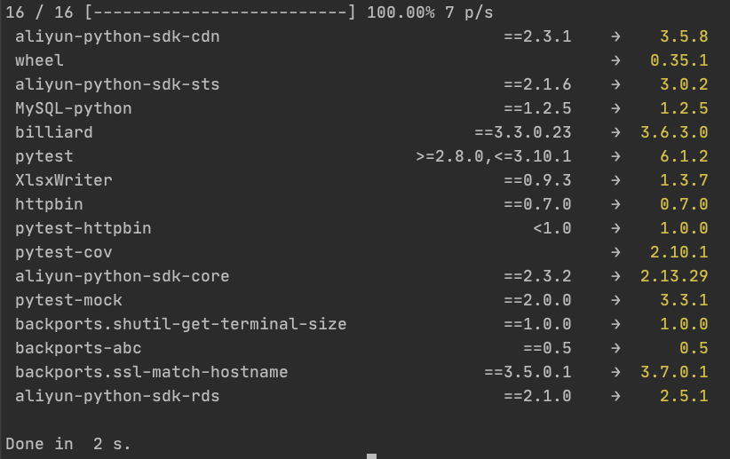

This project is pure entertainment.

这个项目纯碎出于娱乐, `pip` 是更好的包管理工具。

<p align="center">
  <p align="center">
    
  </p>
  
  <p align="center">
    <b>Python Check Updates</b>
  </p>

  <p align="center">
    
    
    
  </p>
</p>


## PCU
Find the latest version of your requirements.txt current dependency package.





## Installation
Deno ships as a single executable with no dependencies. You can install it using the installers below, or download a release binary from the [releases page](https://github.com/xjh22222228/python-check-updates/releases).

Shell (Mac, Linux):
```
curl -fsSL https://raw.githubusercontent.com/xjh22222228/python-check-updates/main/install.sh | bash
```


## Usage

Show any new dependencies for the project in the current directory:

```bash
$ pcu
Checking /opt/requirements_test.txt
13 / 13 [--------------------------] 100.00% 1 p/s
 pytest-cov                                       →   2.10.1
 pytest-mock                           ==2.0.0    →    3.3.1
 httpbin                               ==0.7.0    →    0.7.0
 pytest-httpbin                           <1.0    →    1.0.0
 MySQL-python                          ==1.2.5    →    1.2.5
 aliyun-python-sdk-cdn                 ==2.3.1    →    3.5.8
 XlsxWriter                            ==0.9.3    →    1.3.7
 aliyun-python-sdk-core                ==2.3.2    →  2.13.29
 wheel                                            →   0.35.1
 service-identity                     ==16.0.0    →   18.1.0
 pytest                       >=2.8.0,<=3.10.1    →    6.1.2
 zope.interface                        ==4.3.2    →    5.2.0

Done in  1 s.
```


## Options

```
-f, --file                   Specify the file name of the check dependency
 package, default 'requirements.txt'
-v, --version                output the version number
-c, --check                  Check the latest version
-h, --help                   display help for command
```

## Example
```
$ pcu -f=requirements_test.txt

$ pcu -v
```


## License
[MIT](LICENSE)

